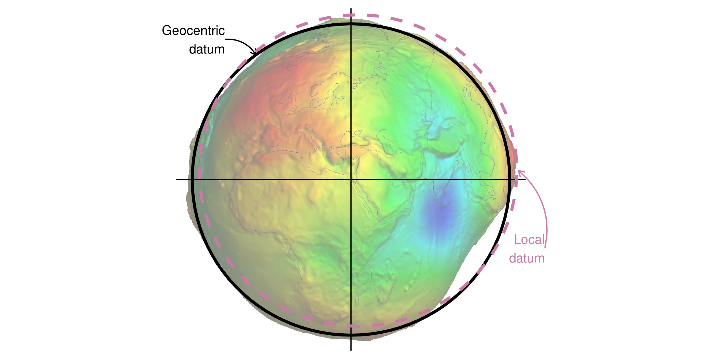

```{r setup, include=FALSE}
knitr::opts_chunk$set(echo = FALSE)
```

```{r}
library("sf")
```

## R Markdown {data-background=pictureExample.png data-background-size=cover}

This is an R Markdown presentation. Markdown is a simple formatting syntax for authoring HTML, PDF, and MS Word documents. For more details on using R Markdown see <http://rmarkdown.rstudio.com>.

When you click the **Knit** button a document will be generated that includes both content as well as the output of any embedded R code chunks within the document.


## What is a Coordinate Reference System? (CRS)

- coordinates consist of two numbers representing distance from an origin, usually in x then y dimensions
- Bullet 2
- Bullet 3


## Definition: Datum

Datum:
- geodetic datum
- local datum

{width=80%}

## Definition: Projection

3d to 2d with no perfect solution

{width=80%}

## What is Simple Features for R? (sf)

<div class="columns-2">
  {width=95%}


- sf is a package providing a class system for geographic vector data
- combines functionality of several previous packages (sp, rgdal and rgeos)
- basic building blocks of sf: different geometry types that are needed for vector geometry types
- well-known binary (WKB) or well-known text (WKT) are the standard encoding
- find more useful information about sf in its vignette (vignette("sf1")

## Slide with R Output
- sf objects are stored in dataframes, the geographical data can be found in the ‘geom’ coloumn (contains coordinates of the country polygons)
Look at this example from the world dataset in sf:
```{r sf, echo = TRUE}

summary("world")

#help does not knit?
```

## Slide with Plot

```{r pressure}
plot(pressure)
```

## Subtitle | This is a subtitle

-Bullet 1

## slide with two coloumns
<div class="columns-2">
  

  - Bullet 1
  - Bullet 2
  - Bullet 3
</div>

## Sources

- Bullet 1
- Bullet 2
- Bullet 3

## Datums for Hertie

- Test von Marco